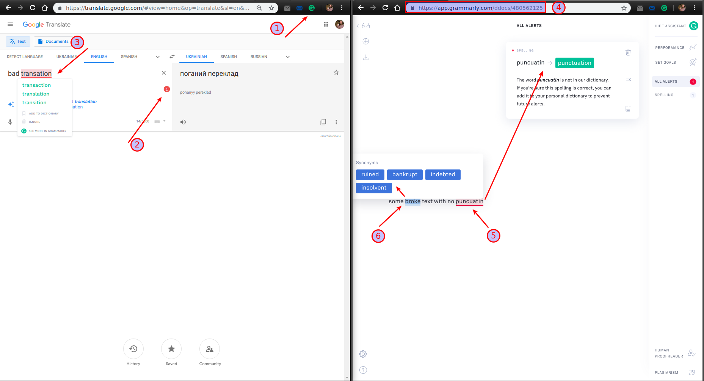

## Grammarly. How to use

**Pros:** partly free, great functionality, built into websites input fields.

1. Install Grammarly extension in your browser to check the accuracy of your English and to learn within the process of correcting errors. 

2. The extension (1) will check the majority of input fields (2) of the most popular web services right into your browser. You will never do big mistakes in your texts.

3. You will be given the correct options of misspelled words or in case of incorrect punctuation (3).

4. When you need to check large writing it is more comfortable to use Grammarly site itself (4). It will give you not only the possibility to refine your text (5) but also improve it with some synonyms (6).