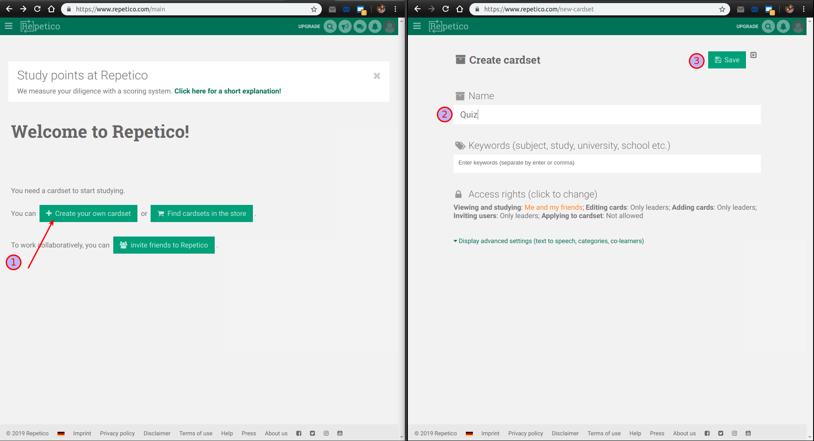
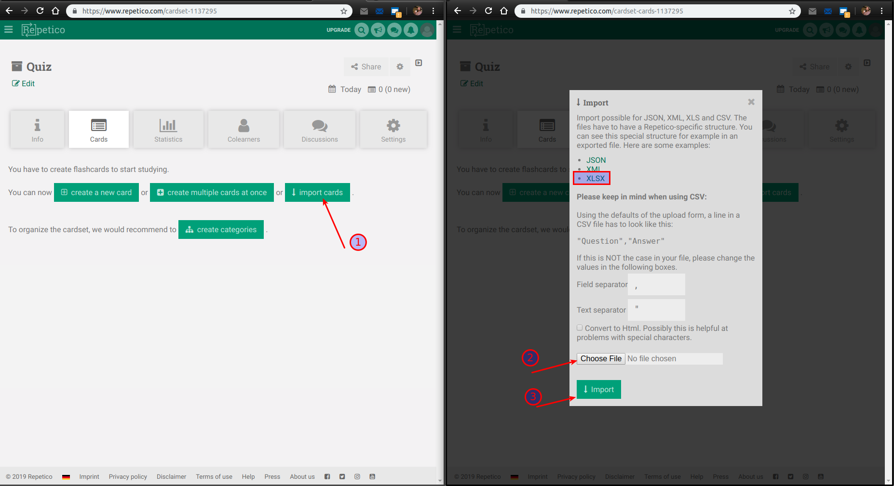
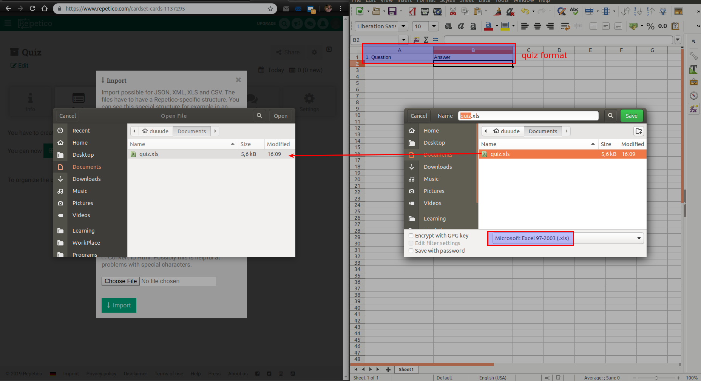
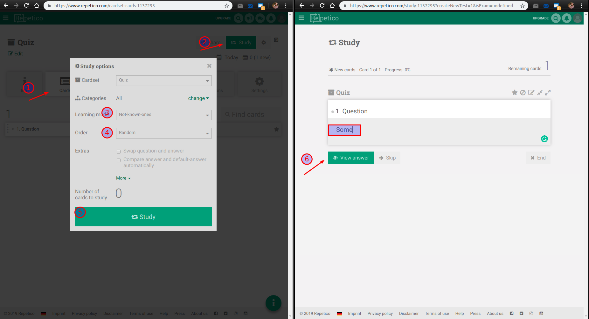
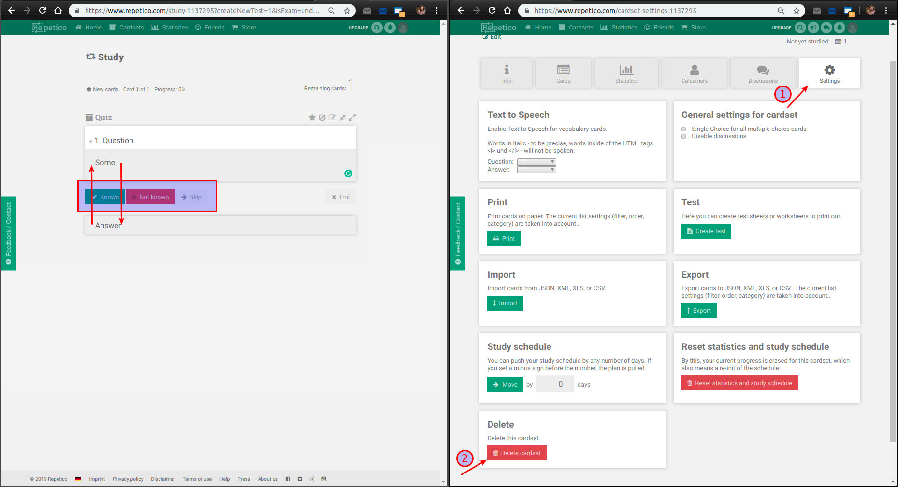

## Repetico. How to use

**Pros**:

- available both web and mobile versions;
- on mobile version could work in offline mode (should be synchronized although);
- free format of questions;
- user decides about the correctness of an answer. 

**Limitations for free version**:

- only one active cardset; 
- maximum of 200 questions per cardset.

1. Create cardset with requisites.

2. Import cards into it

3. The easiest way to compose questions is in the 'excel' form (formats .xls, .xlsx)

 

4. Use learning modes for repeating and memorizing

5. The user chooses correctness of an answer. Each cardset should be removed for using the next one.

