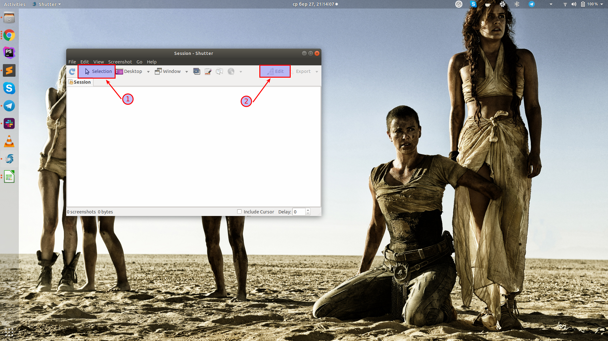
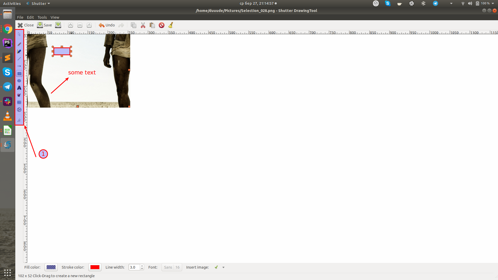

## Shutter. How to use

**Pros:** free, light, customizable

1. Use the Selection button (1) for taking screenshots of the cut area or set a hotkey combination (recommended) as described here. Use the Edit button to update taken screenshots.

2. Explore all the functions to make you screenshots informative (1) 

**Important**: for using the Edit option in Ubuntu 18.04 you need to install additional libraries, use tutorial.