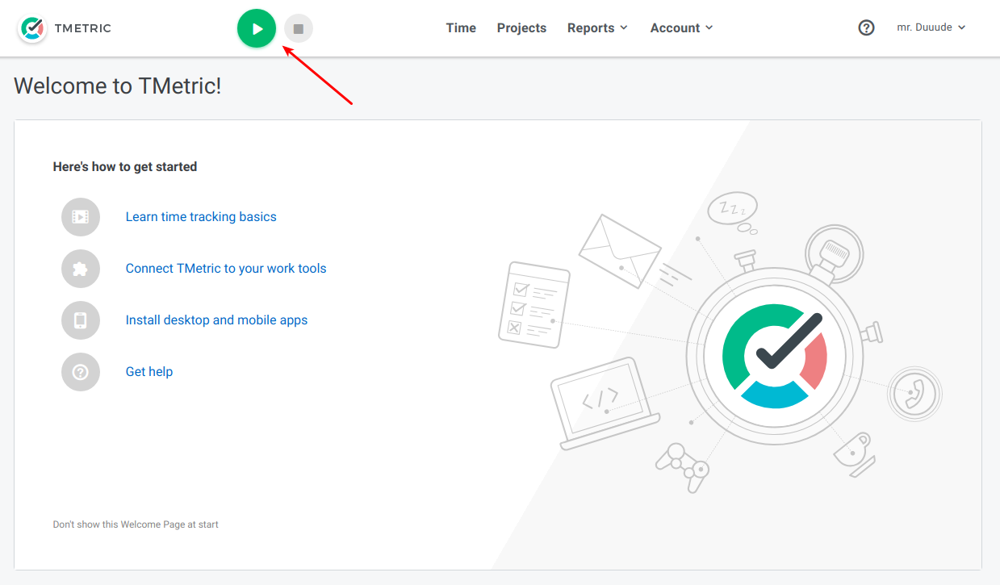
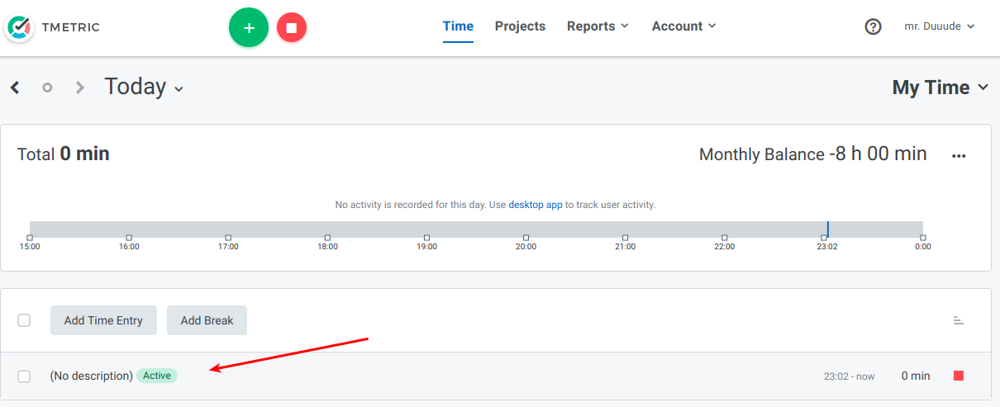
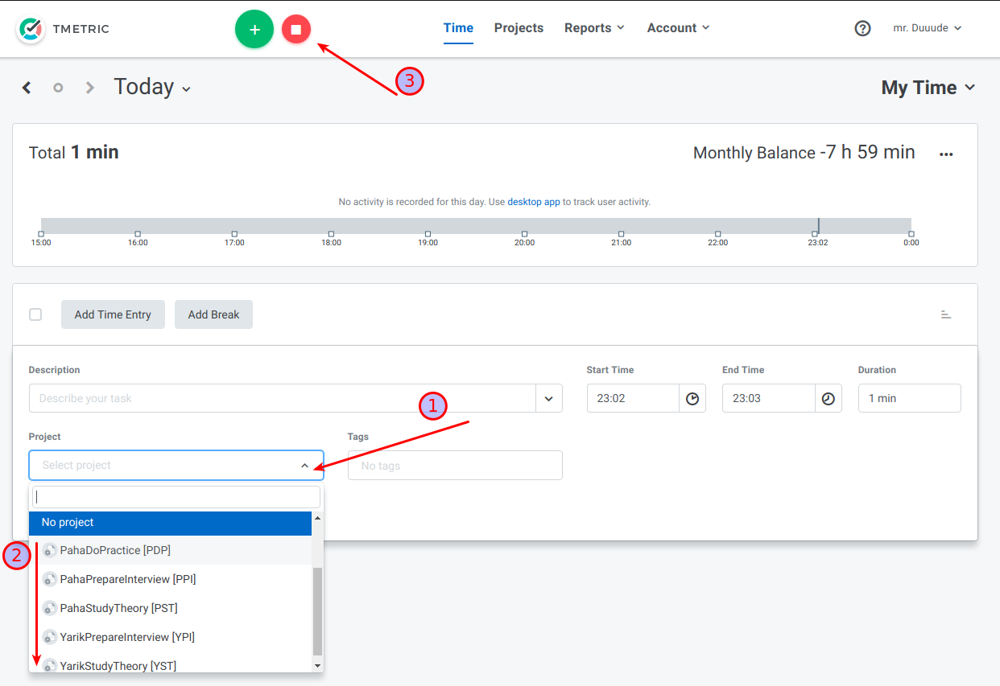
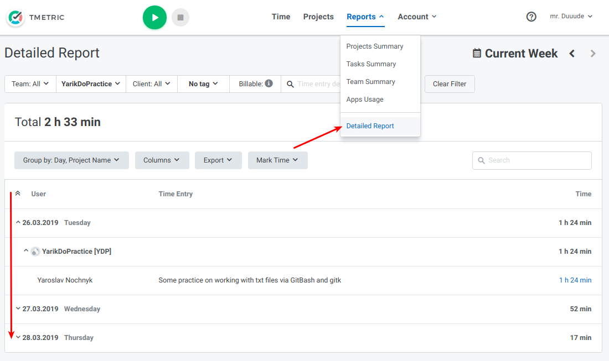
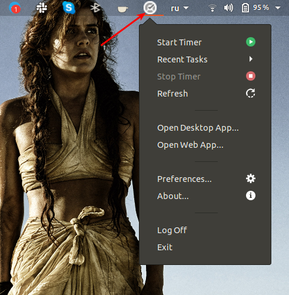
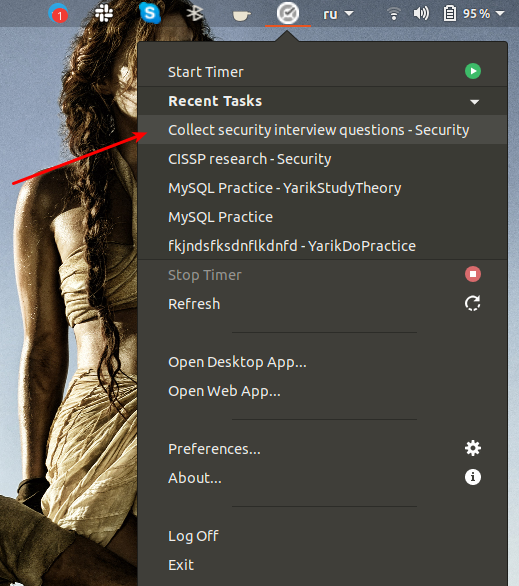
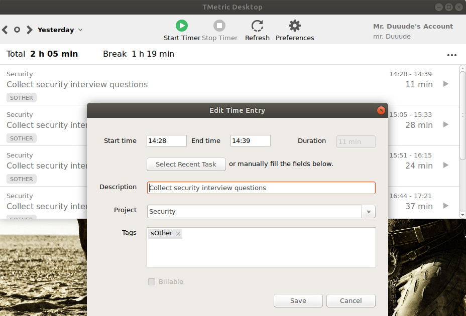
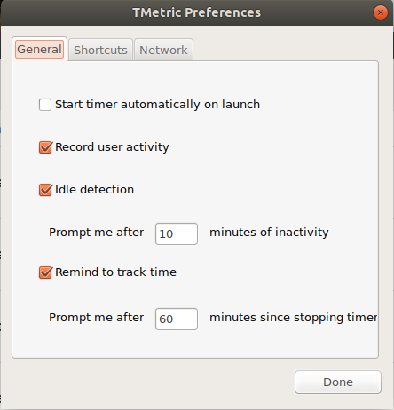

## TMetric. How to use

**Pros**: partly free, customizable, modest statistic reports, got a desktop version

1. Start time tracking

2. Click your time entry 

3. Edit time entry attributes properly to use in for filtration in reports

4. Use Detailed Report to check and analyze your activity

5. Use desktop version for faster process of recording

6. You could continue every relevant process with already filled attributes

7. Update recordings alike through the web interface but faster

8. Configure the application to work according to your needs, i.e. activate recording on startup of the system

