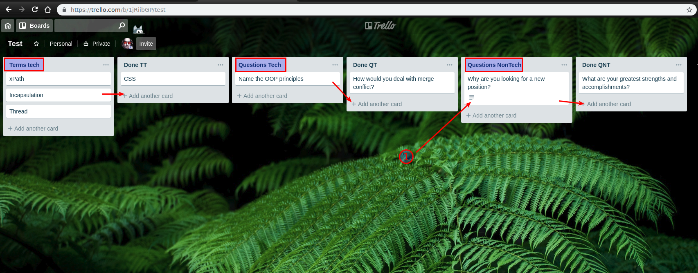
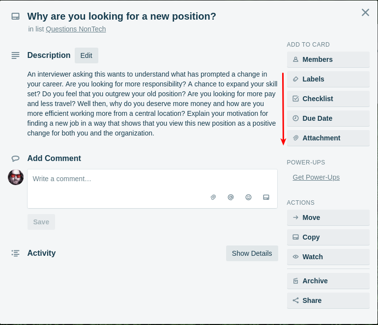
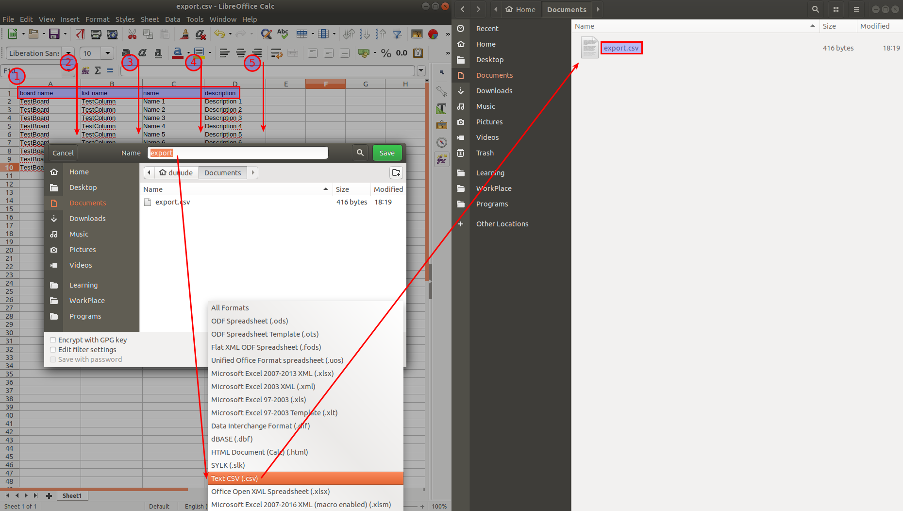
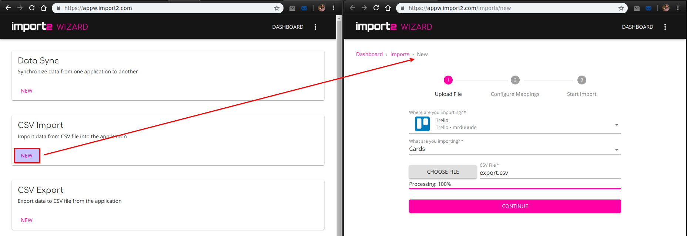
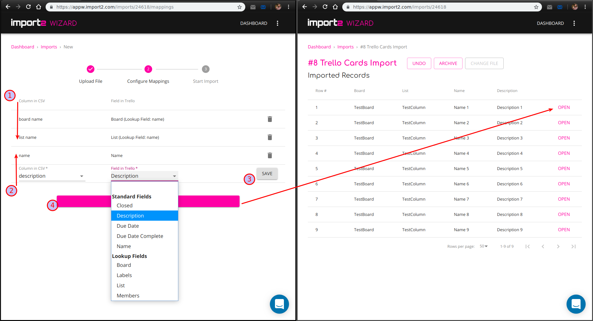
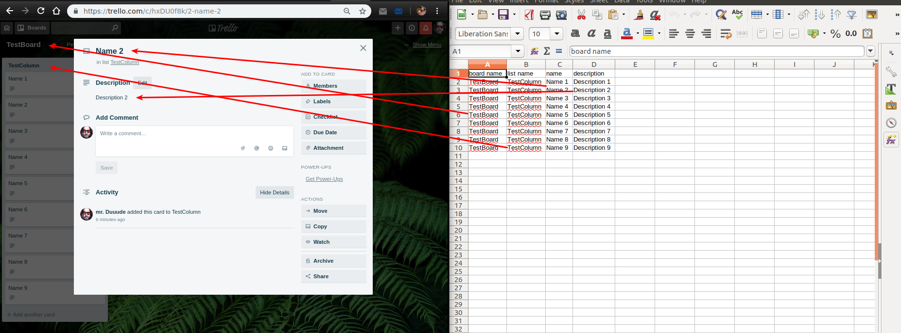

## Trello. Using for memorizing

**Note**: this is only the recommendation, not the rule

1. Try to systemize all the information you need in your study. Over time some information is lost from a person's memory. The proper handling of needed data is helpful from the perspective of regular exams.

2. With the use of Trello board, you can break the main notions in a few groups and track the status of them. Details (1) can store the answer or some additional tips to the term. OR, if there are many lists, you could just mark the card using stickers or symbols within the card name.

3. Do not hesitate to use all the options to help yourself with memorizing, i.e. use checkboxes, illustration or timer for better recognition.

4. There is an option to use export of boards or cards to the Trello after using more comfortable services (i.e. spreadsheet editors) to collect and organize them.
Example: The first row should be filled with arbitrary column names (1). Fill each cell of one of the columns (2) with the exact name of the target board, each cell of another column (3) with the name of the target list. The other columns (4) (5) could be used for storing all the needed data, i.e. name and description of the card.

5. Use the Import2 Wizard to work with exporting/importing data. Sign up and choose CSV import, integrate the wizard with a service, choose a type of data and data source.

6. Map the names of the board and the list to target the cards (1). Map other columns with the data to card attributes (2). Save mappings and start the import. After the import finished use the ling to navigate to the target board.

7. Proper mapping should work as intended.

