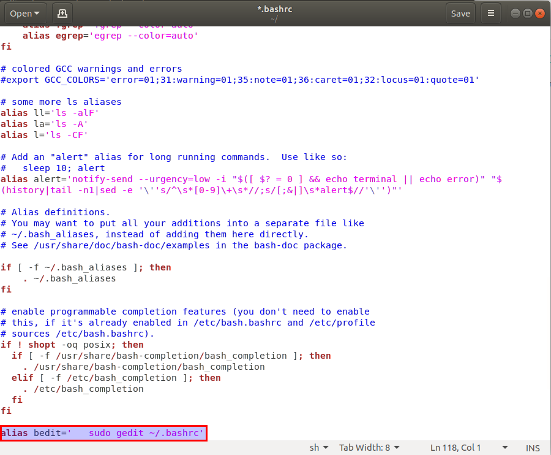

## Ubuntu. Custom terminal commands

1. Use system terminal from the list of applications or with the **Ctrl+Alt+T** combination.

2. Type ```sudo gedit ~/.bashrc``` command.

3. At the end of the file add a line with a custom command in the  exact same format as others, example:



4. Save and close the file. Enjoy using your new custom command to make your work more efficient and faster.

