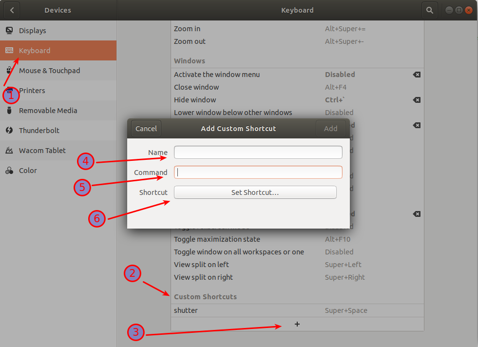
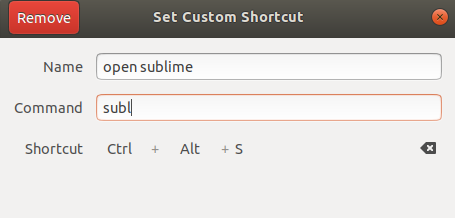

## Ubuntu. Keyboard shortcuts

Each terminal command could have its own hotkey combination for better usability.

1. Open Settings > Devices > Keyboard or click **SUPER** and type 'Keyboard' > Keyboard Shortcuts > Custom Shortcuts > Add Custom Shortcut (3).
2. Fill in the name of the shortcut (4), the command itself (5) and specify the combination of keys (6).

3. Example:

4. Close the window and enjoy using your new combination to make your work more efficient and faster.